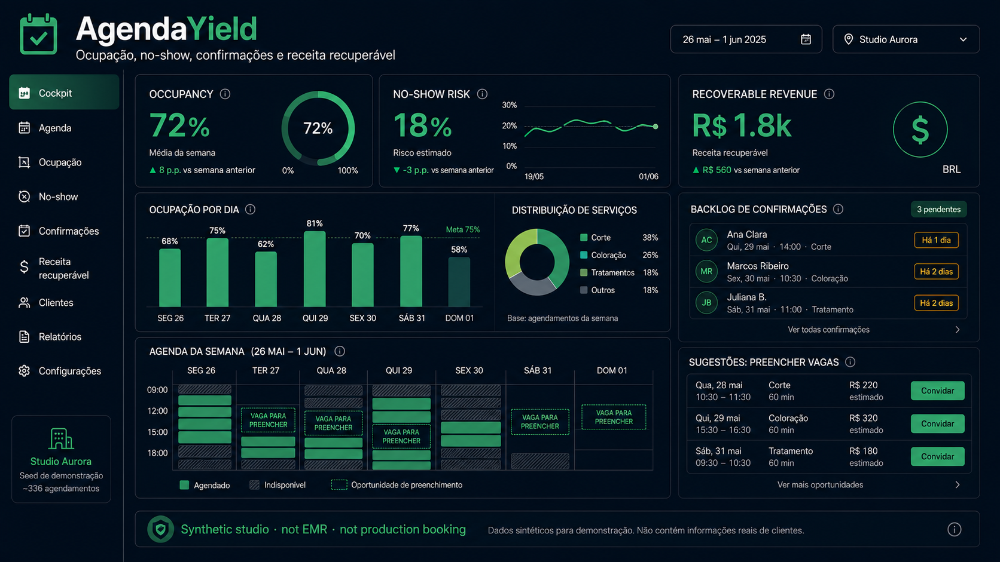

  

  <h1>AgendaYield</h1>

  
<strong>Cockpit de yield de agenda — ocupação, risco de no-show, fila de confirmação e receita recuperável.</strong>

  
<strong>Agenda yield cockpit — occupancy, no-show risk, confirmation backlog and recoverable revenue.</strong>

  

    <a href="#pt-br">PT-BR</a> ·
    <a href="#en">English</a> ·
    <a href="#live-demo">Live Demo</a> ·
    <a href="#stack--tecnologias">Stack</a> ·
    <a href="#arquitetura--architecture">Architecture</a> ·
    <a href="#quick-start--início-rápido">Quick Start</a> ·
    <a href="#autor--author">Author</a>
  

  

    
    
    
    
    
    
    
  

  

    <a href="https://barujafe1.github.io/AgendaYield/"><strong>Live Demo</strong></a> ·
    <a href="https://github.com/BarujaFe1/AgendaYield"><strong>Repositório</strong></a> ·
    <a href="https://barujafe.vercel.app/"><strong>Portfólio</strong></a> ·
    <a href="https://www.linkedin.com/in/barujafe/"><strong>LinkedIn</strong></a>
  

  

---

## PT-BR

## Visão geral

**AgendaYield** é um cockpit de yield para negócios de serviço: ocupação, risco de no-show, backlog de confirmação e receita recuperável em formato de lab.

> **Aviso de lab:** demo de portfólio com dados sintéticos/amostra. Não é produto em produção com SLA, integrações reais de clientes ou garantia operacional.

---

## Problema

Agendas cheias no papel ainda perdem dinheiro com no-show e confirmação atrasada. Falta um painel de yield operacional.

---

## Para quem

- Clínicas, salões e serviços com agenda
- Operações de atendimento
- Gestores de receita de serviço

---

## Funcionalidades

- Ocupação da agenda
- Risco de no-show
- Backlog de confirmação
- Receita recuperável
- Demo GitHub Pages

---

## Escopo e limites

- **É:** lab de yield de agenda.
- **Não é:** sistema de marcação completo, WhatsApp production, PMS hospitalar.

---

## English

## Overview

**AgendaYield** is a yield cockpit for service businesses: occupancy, no-show risk, confirmation backlog and recoverable revenue as a portfolio lab.

> **Lab notice:** portfolio demo with synthetic/sample data. Not a production product with SLA, real customer integrations, or operational guarantees.

---

## Problem

Paper-full agendas still lose money to no-shows and late confirmations. Teams lack an operational yield panel.

---

## Who it is for

- Clinics, salons and appointment-based services
- Front-desk operations
- Service revenue managers

---

## Features

- Agenda occupancy
- No-show risk
- Confirmation backlog
- Recoverable revenue
- GitHub Pages demo

---

## Scope and limits

- **Is:** agenda-yield lab.
- **Is not:** full booking system, production WhatsApp, hospital PMS.

---

## Live Demo

**URL:** [https://barujafe1.github.io/AgendaYield/](https://barujafe1.github.io/AgendaYield/)

Demo hospedada para avaliação de portfólio / Hosted for portfolio review.

> Lab demo — synthetic / sample data unless noted. Not a production SLA product.

---

## Stack / Tecnologias

| Tecnologia | Uso no projeto |
|---|---|
| Next.js 15 / React 19 / TypeScript | UI |
| Recharts / Lucide | Charts |
| FastAPI / Pandas / NumPy | Métricas e API |
| Pytest / Ruff | Testes |

---

## Arquitetura / Architecture

Monorepo API + web; workflow GitHub Actions possível em .github/.

`	xt
AgendaYield/
├── .github/workflows/
├── apps/
│   ├── api/
│   └── web/
├── assets/
├── data/seed/
├── docs/
├── scripts/
└── start.bat
`

---

## Quick Start / Início rápido

### Pré-requisitos / Requirements

- Node.js 20+
- Python 3.12+
- npm

### Clonar / Clone

`ash
git clone https://github.com/BarujaFe1/AgendaYield.git
cd AgendaYield
`

### Windows (atalho)

`at
start.bat
`

Sobe API em :8000 e web em :3000.

### Manual

`ash
# API
cd apps/api
python -m venv .venv
# Windows: .venv\Scripts\activate
# macOS/Linux: source .venv/bin/activate
pip install -r requirements.txt
uvicorn app.main:app --reload --port 8000
`

`ash
# Web (outro terminal)
cd apps/web
npm install
npm run dev
`

Abra http://localhost:3000

Copie .env.example se precisar de NEXT_PUBLIC_API_URL.

---

## Technical decisions / Decisões técnicas

- **Receita recuperável** como métrica de ação, não só ocupação.
- **Pages** para demo estável.
- **Seeds** sem PII real de pacientes/clientes.

---

## Roadmap

### Implementado
- Ocupação, no-show, confirmação, receita recuperável, Pages

### Planejado
- Regras de overbooking simuladas
- Integração mock de confirmação
- Mais segmentos de serviço

---

## Autor / Author

Developed by **Felipe Alirio Baruja**.

- **Portfolio:** [https://barujafe.vercel.app/](https://barujafe.vercel.app/)
- **GitHub:** [github.com/BarujaFe1](https://github.com/BarujaFe1)
- **LinkedIn:** [linkedin.com/in/barujafe](https://www.linkedin.com/in/barujafe/)
- **Repository:** [github.com/BarujaFe1/AgendaYield](https://github.com/BarujaFe1/AgendaYield)

---

## License / Licença

MIT License.

See [LICENSE](./LICENSE) for details.

---

  
<strong>AgendaYield</strong>

  
Agenda com yield e receita recuperável.

  
<em>Agenda yield with recoverable revenue.</em>

